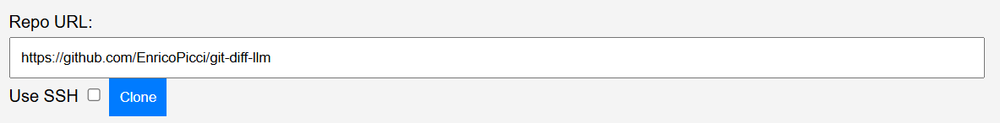
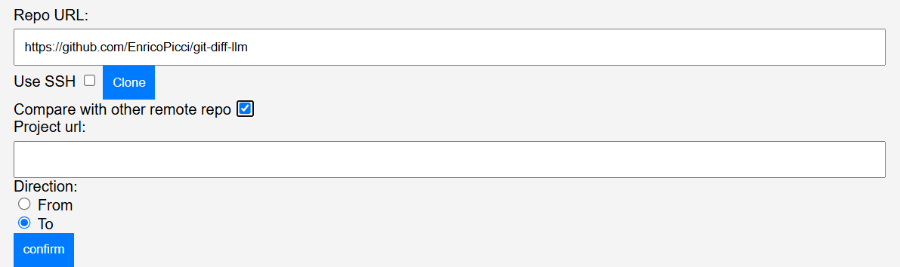
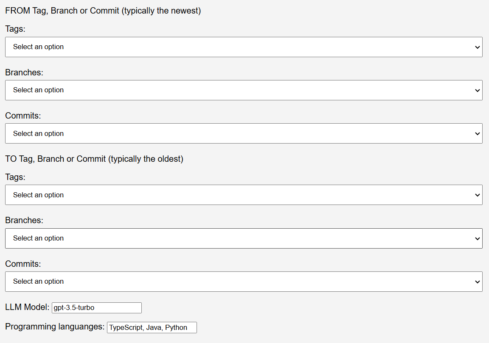
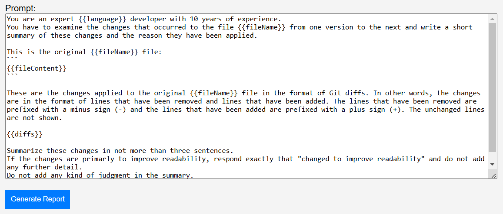
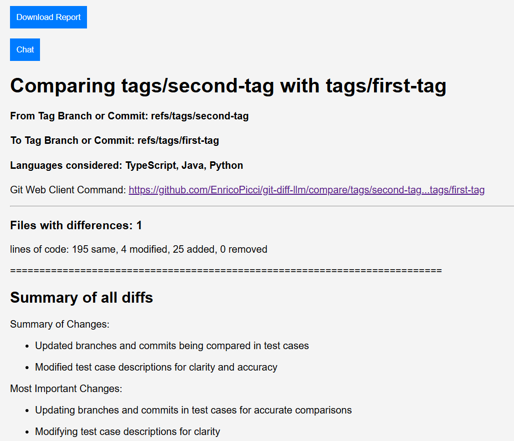

# git-diff-llm
**git-diff-llm** is a command linetool that generates information about the differences between two git repositories, usually a forked repository and its upstream repository or between two branches of the same repository.\
Let consider the case of a project that was forked at point **A**. After point **A** both the forked project and its upstream have evolved.\

Let's assume we want to have information about the distance between the upstream project at point **C** and the forked project at point **B** (**C** and **B** can be tags or branches or even commits).\ 
The tool generates a report with information about the distance between **C** and **B** in terms of:
- The number of files that are different between the two repositories at point **C** and **B**
- The number of *lines of code* (LoC) that are added, removed or modified between the two repositories at point **C** and **B** - comments and blank lines are not counted
- A summary of the changes in the two repositories at point **C** and **B** - the summary is produced by an LLM (Large Language Model) starting from the diff of the two repositories and a prompt template
- A summary of the changes for each file which has differences in the LoC

## Running the tool
Currently the tool works only with [OpenAI](https://openai.com/) LLMs. So you need to make sure that the OpenAI API key is set in the environment variable `OPENAI_API_KEY`.

### Running the tool with npx
To run the tool, follow these steps:
- Make sure that the OpenAI API key is set in the environment variable `OPENAI_API_KEY`
- Run the command `npx git-diff-llm` to launch the server side of the tool. If an error occurs, try to clean the npx cache with the command `npx clear-npx-cache`.
- At the end of the server startup, the tool prints on the console the *URI File Scheme* to use to access the tool in the browser, for instance `file:/C:\Users\my.name\AppData\Local\npm-cache\_npx\2250f8eed83b8eed\node_modules\git-diff-llm\src\core\browser-client.html` (the path is different depending on the OS, for instance with Ubuntu running on wsl the *URI File Scheme* is `file://wsl.localhost/Ubuntu/home/_npx/2250f8eed83b8eed/node_modules/git-diff-llm/src/core/browser-client.html`)
- Open the browser and paste the *URI File Scheme* in the address bar to access the tool

### Running the tool downloading the code
To run the tool directly from the code, follow these steps:
- Clone the **git-diff-llm** repository 
- Run the command `npm install` to install the dependencies
- Launch the server side of the tool with the command `npm run start`
- Open the browser and paste the *URI File Scheme* in the address bar to access the tool (the *URI File Scheme* is printed on the console at the end of the server startup)

## Parameters
The tool requires the following parameters:
- The URL of the first repository\

- The URL of the second repository, if we want to compare a forked repository with its upstream repository (or another fork for that matter). In this case we need to select the "Compare with other remote repo" checkbox, provide the URL of the second repository and click on the "Confirm" button.
\

- The tag or branch or commit of the first repository (the so called FROM repository)
- The tag or branch or commit of the second repository (the so called TO repository)
- The LLM model to use to generate the summaries of the changes in the two repositories
- The extensions of the files to consider in the comparison (for instance `.js,.ts,.html,.css`)
\

- The prompt template to use to generate the summaries of the changes for each single file that has changes in the LoC. The prompt template can contain placeholders:
    - `{{fileContent}}`: where the content of the file (at the FROM tag or branch or commit) is inserted
    - `{{diffs}}`: where the diffs of the file (in git diff format) are inserted
    - `{{fileName}}`: where the name of the file is inserted
    - `{{language}}`: where the extensions chosen by the user are inserted
\

## Output
Once the "Generate Report" button is clicked, the tool generates the following information:
- The number of files that are different between the two repositories at specific tags or branches or even commits
- The number of *lines of code* (LoC) that are added, removed or modified between the two repositories at specific tags or branches or even commits - comments and blank lines are not counted (to get this information the tool uses the [cloc tool](https://github.com/AlDanial/cloc/tree/master) tool, specifically the `cloc --git-diff-rel --by-file` command)
- A summary of the changes in the two repositories at specific tags or branches or even commits - the summary is produced by an LLM (Large Language Model) starting from the diff of the two repositories and a prompt template
- A summary of the changes for each file which has differences in the LoC
\

The result report can be downloaded in a Markdown format by clicking on the "Download Report" button.

## Current known limitations
- The tool can not generate the correct "Git Web Client Commands"  when comparing an upstream repo with a forked repo in GitLab. In other words the commands generated to get the comparisons between the two repos using the Web Client for gitlab are not correct.

## Structure and scaffolding
git-diff-llm is a node app configured to use Typescript scaffolded using the package `@enrico.piccinin/create-node-ts-app`.

git-diff-llm can be published as a package on the public NPM registry.

Once published, git-diff-llm can be invoked to execute a command using `npx`

Contains a configuration for `eslint` and `prettier`.

Testing is based on the `mocha` and `chai` libraries.

The `src` folder has the following structure:

-   `lib` folder containing the command
-   `core` folder containing files which implements the logic to execute the command
-   `internals` folder containing the internals of the logic of the command

## test

Run the tests using the command

`npm run test`

